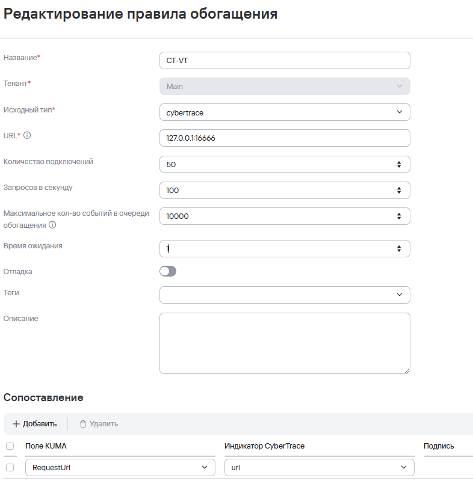
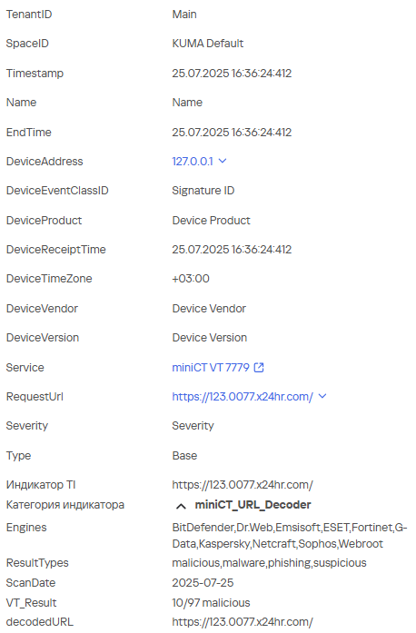

# Tracer.py — URL Enrichment Server with VirusTotal Integration

## 📌 Описание

`Tracer.py` — это простой TCP-сервер на Python, предназначенный для приёма строк с URL, извлечения и декодирования параметра `url=...`, и отправки его в [VirusTotal](https://virustotal.com) для анализа.

Ответы клиентов обогащаются данными из VT и отправляются обратно в формате `key=value|...`.

Основное предназначение обогащение событий в SIEM KUMA

---

## 🚀 Возможности

- Поддержка нескольких клиентов (через select)
- Интеграция с VirusTotal v3 API
- Подсчёт количества сработавших антивирусов
- Извлечение тегов, категорий, финального URL и других параметров
- Форматированный ответ в стиле KUMA-интеграции

---

## 📥 Установка

1. Установите зависимости:
```bash
pip install -r requirements.txt
```
Для использования TCP_FASTOPEN (рекомендуется) на ОС Linux выполните команду ниже и переиспользование портов:

echo 3 > /proc/sys/net/ipv4/tcp_fastopen
echo 1 > /proc/sys/net/ipv4/tcp_tw_reuse

Предварительные правки для Tracer.py:

SERVER = "127.0.0.1" (строка кода 14) - укажите IP-адрес для прослушивания
PORT = 16666 (строка кода 15) - укажите порт для прослушивания


2. Вставьте ваш API-ключ от VirusTotal:
```python
VT_API_KEY = "ВАШ_КЛЮЧ" 66 строка
```

---

## ⚙️ Запуск

```bash
python3 Tracer_with_VT_URL.py
```

Сервер будет слушать порт `16666`. Вы можете подключаться клиентом (`nc`, `telnet` или своим скриптом) и отправлять данные для проверки
Передавать в KUMA

---

## 📤 Пример входящего сообщения:

```
some_id|url=https%3A%2F%2Fevil.com|more_data
```

## 📥 Пример ответа:

```
Category=miniCT_URL_Decoder|MatchedIndicator=https%3A%2F%2Fevil.com|decodedURL=https://evil.com|VT_Result=5/97 engines flagged|Engines=Dr.Web,Sophos|Tags=phishing|ScanDate=2025-07-25|ResultTypes=malicious,phishing
LookupFinished
```

---

## 📁 Структура проекта

- `Tracer.py` — основной серверный скрипт
- `requirements.txt` — зависимости Python
- `README.md` — этот файл

---

## ✅ Совместимость

- Python 3.6+
- Linux, macOS, Windows (лучше Linux)

---

## Настройка на стороне SIEM KUMA
Создать правило обогащения со следующими настройками на скрине:


Прикрепите правило к сервису коллектору, обновите сервис коллектора
Сопоставление с полем RequestURL
По картинке выше, обогащается значение поля RequestURL и сопоставляется с полем Tracer - url.
Производительность скрипта состовляет ~ 50 EPS, при рекомендуемой настройке Enrichment (количество подключений): 50 connections и 50 RPS (запросов в секунду).
Если использовать в пропорции 500 / 500, то можно обогащать примерно 500 EPS событий без потерь.


Для проверки полной цепочки направьте тестовое событие на порт коллектора с нормализатором CEF
Командой:
 nc <адрес> <порт коллектора> <<< 'CEF:Version|Device Vendor|Device Product|Device Version|Signature ID|Name|Severity|request=https://123.0077.x24hr.com/'